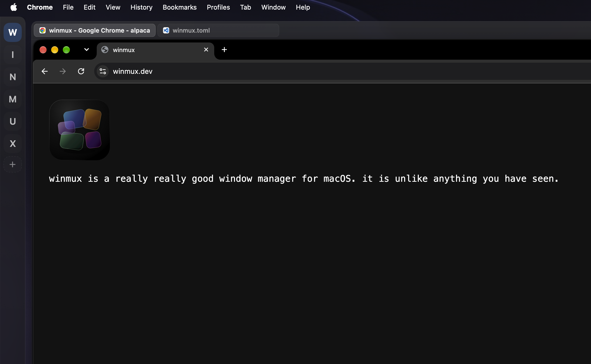
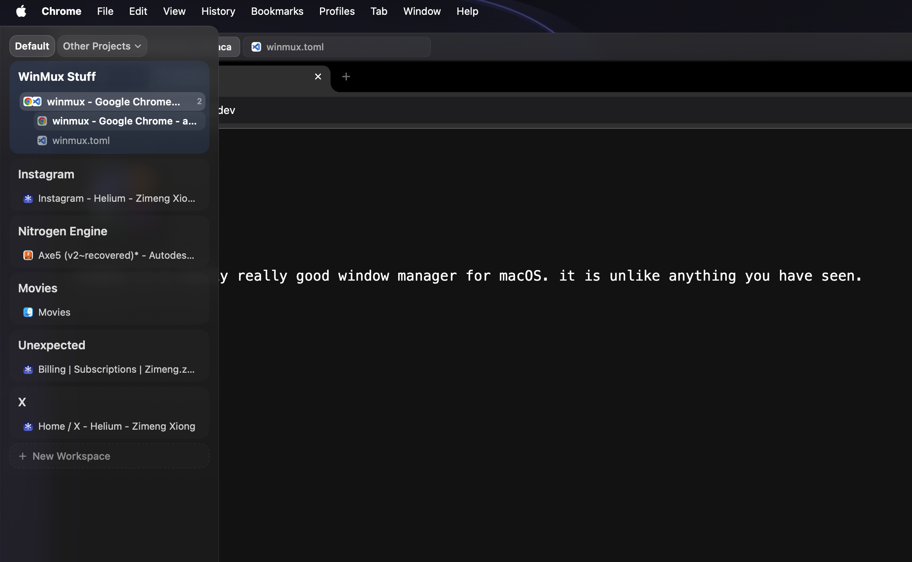
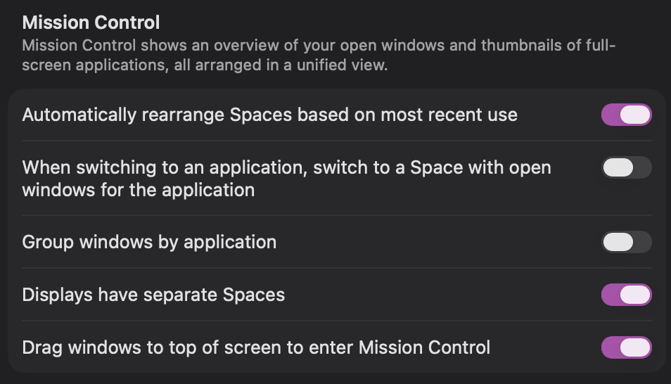
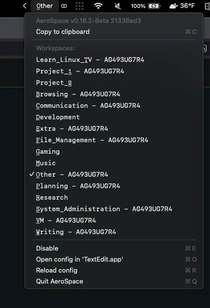
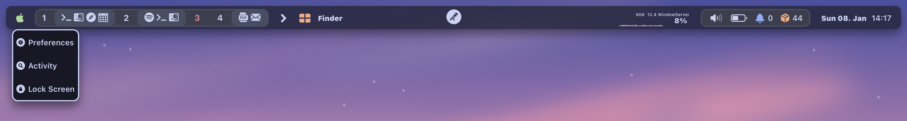
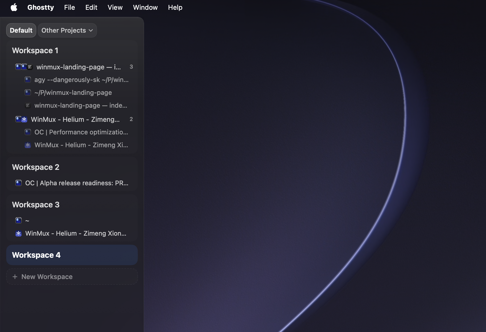
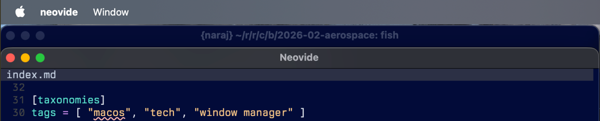
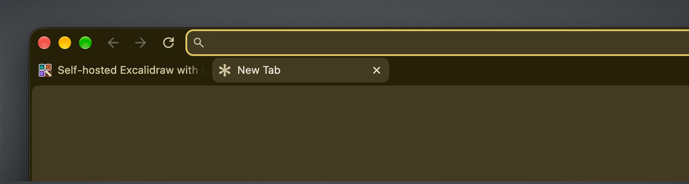
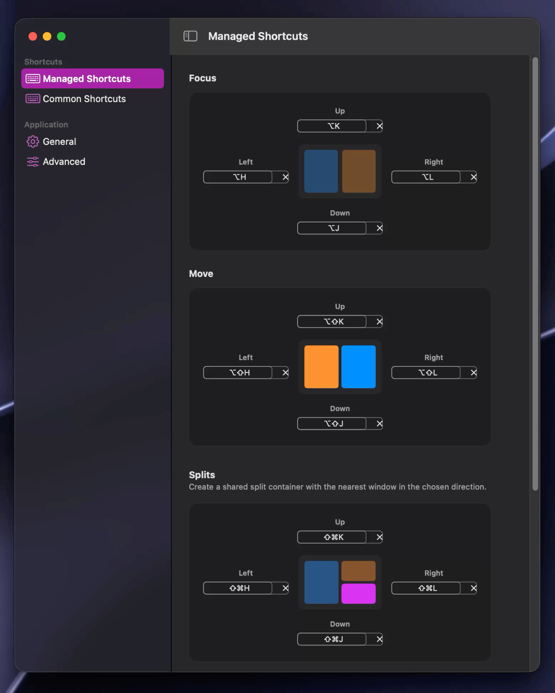

 

winmux solves four main problems with existing window managers:
1. they have no idea what spaces actually are
2. they don't show you where your stuff is
3. they let you have too many spaces
4. config hell

~*~


# let's overwrite some intuitions first, this won't take long!
you can think of a space (as [macOS](https://en.wikipedia.org/wiki/MacOS) calls it) as a "virtual desktop" or a "virtual monitor." as a way to get more displays without buying more physical monitors.

```
[ virtual monitors ]
+-----------+  +-----------+  +-----------+
|  space 1  |  |  space 2  |  |  space 3  |
+-----------+  +-----------+  +-----------+
      |
      v
+-----------+
|  display  |
+-----------+
```

while this approach is intuitive and easy to understand, i think it is the wrong idea of how we should conceptualize spaces

## multi-monitor, multi-problem
things get messy as soon as we add a second *physical* display. do our virtual monitors belong on display 1 or 2? or should they be shared? why should one monitor only be allowed to "emulate" a certain subset of all virtual monitors? 

```
+-------------+   +-------------+
|  display 1  |   |  display 2  |
|  (space 1)  |   |  (space ?)  |
+-------------+   +-------------+
```

spaces and virtual desktops become this incomprehensible and almost impossible to define virtual object that we only kind of understand the notion of. we don't really know where it belongs or why it belongs there. we are just used to using it, so we take it as it is given to us.

i only use this as an example of why the space connotation is confusing, (personally, i advocate against multi-monitor setups *unless* the second monitor is only displaying static content (task monitor, logs, terminal, etc))

### and it's all Apple's fault

tangential—but i really want to emphasize the atrocity that is the first option, which (on by default) allows macOS to MOVE YOUR SPACES AROUND so that what was `Space 1` could be `Space 4`, causing you to lose all spatial awareness of your already confusing enough virtual desktops

what i really want to talk about is the -2nd item on the list,
```
Displays have separate Spaces
```

the notion of virtual desktops hasn't been fully clear, but it was at least OK, until this. what do you mean by this, [Apple](https://www.apple.com/)? so what are spaces, really? if they are virtual desktops (virtualized physical displays), why should they be bound to physical displays? 

you don't force your bedroom TV to channels 5-9 while your living room TV gets access to 1-4. [`tmux`](https://github.com/tmux/tmux) doesn't restrict one session to panes 1-4 while other connected clients get 5-9.

> "if you hate it so much just turn it off and stop whining so much"

yes, and you should. but what i wanted to highlight here is the mere existence of this option means that no one at Apple really understands what spaces are and why they exist (they shouldn't)

## a better approach to understanding virtual desktops
there have been so many similar virtualization technologies that have emerged it shocks me that we are this behind on virtual desktops 

instead of being the greedy beings we are and wishing for more physical monitors, start thinking about Spaces as purely virtual blobs with no physical representation.

they are instead, somewhat analogous to files (isn't everything? very [UNIX](https://en.wikipedia.org/wiki/Unix) indeed) and file managers.

when you want to observe a file, you open a file viewer. if you want to observe multiple files in different locations at the same time, you open multiple file viewers.

```
( space 1 )     ( space 2 )     ( space 3 )
     |                               |
     v                               v
+-----------+                   +-----------+
| display 1 |                   | display 2 |
+-----------+                   +-----------+
```

this means all displays can access all of the spaces, and makes understanding multi-monitor window managers so much easier.

you might think it is trivial, but window managers like [Yabai](https://github.com/koekeishiya/yabai) and [AeroSpace](https://github.com/nikitabobko/AeroSpace) STRUGGLE to handle multiple monitors because they are still stuck on trying to replicate macOS's `Displays have separate Spaces`. WMs kill themselves trying to do this.

# empty spaces shouldn't exist
this also means that empty spaces FUNDAMENTALLY SHOULD NOT EXIST. there is NO POINT in "reserving a space" for future use (you wouldn't open an empty file). here's what it looks like when you move the last window in a workspace to another workspace:


the only type of empty workspace we allow if it is the N+1 where N is the last occupied workspace, this allows you to temporarily create a empty workspace to open new windows in, but if you leave without doing so, the workspace gets garbage collected

winmux does both of these well, and supports multi-monitor in an intuitive way like nothing else i have tried

# WHERE ARE ALL MY SPACES? FIND ME MY WINDOWS!
when you install a window manager like [AeroSpace](https://github.com/nikitabobko/AeroSpace), you are left quite baffled at where things are. am i on workspace A, B, or C? how do I know? oh wait, there's a menu bar icon, let me click that...


thanks! now i know where everything is...

if we look past the garbage text (indicating which display each workspace belongs to (again, the more inefficient conceptual way to understand spaces)), this doesn't really tell us anything. and since AeroSpace uses virtualized desktop environments instead of native macOS spaces for managing windows (which is the better approach, in my opinion), we have no idea where all of our windows are.

you can solve this with something like [SketchyBar](https://github.com/FelixKratz/SketchyBar) and [sketchybar-app-font](https://github.com/kvndrsslr/sketchybar-app-font), to get a status bar that looks like this that shows what apps are in what spaces


and this is a fine idea, if it wasn't for the fact this is external to the window manager, which means it updates lazily and often lags behind AeroSpace or Yabai or is just straight up incorrect.

it's a fine idea, if it wasn't for the fact that the menu bar also lives at the top, meaning you have to hide the application's `File->` menu and all your menu bar icons. yes, you can configure it to be on the sides of your screen, but such a thin bar doesn't allow much information to be shown vertically.

the solution really is to have a status bar integrated with your window manager, and winmux does exactly that

 

nothing goes out of sync, and you know where your windows are all the time. it's also written fully in [Swift](https://www.swift.org/) so it feels responsive and intuitive.

and since it's written in Swift and not [Lua](https://www.lua.org/), drag and drop is also much easier to implement


arranging windows also doesn't require keyboard shortcuts (though they are definitely supported) via "intent zones" that show up on hover:


## 13th story windows (or: why window stacking is broken)
and not only do we show you where your spaces are, we also show you where your stacked windows are!

for those unfamiliar, AeroSpace and Yabai both allow you to create "stacks" of windows, i.e. windows occupying the same underlying footprint, raised to the top one at a time. 

however both utterly fail in their execution at doing so.

Yabai makes no effort to indicate how many windows are in a stack, you're just left with a stack hidden amongst your windows.

AeroSpace tries with accordions, where each window's footprint is slightly offset compared to the footprint of the window above it, so that a portion of it "peeks" out, e.g.



this approach results in lost vertical space proportional to how many windows you have in a stack (ridiculous!).

yet again, this is a solved problem, and you have already used them before: browsers, anyone?



you don't open a new window each time you want to visit a new website, you open a new **tab**.

winmux brings the power of tabs to window stacking, so you can turn two unrelated applications (e.g. [Finder](https://en.wikipedia.org/wiki/macOS_Finder) and your browser) into a singular, tabbed "window":


(if you are worried about losing vertical space 1/ don't, these demos are recorded on a 720p resolution (which no one uses) so it's easier to see, and 2/ check out the [Helium](https://helium.computer/) browser!! [Chrome](https://www.google.com/chrome/) is used here because it is more commonly recognized, Helium is much more compact (see the image above this video))

and yes, you can configure whether new windows opened while focused on a tab group will be automatically added to the tab group or treated as a tab outside the tab group

# zero click config

winmux doesn't require disabling [SIP](https://en.wikipedia.org/wiki/System_Integrity_Protection) (it's built on the fantastic virtualization framework of [AeroSpace](https://github.com/nikitabobko/AeroSpace)), nor does it require you to write a config file! (still uses it for a SSOT, but you don't ever need to see it). it ships with (my) defaults or adopts existing AeroSpace configurations. you can do (most) things via GUI :)



# tap tap tap

winmux supports a special type of keyboard shortcut: single taps:

```
[mode.main.binding-tap]
    left-alt = 'exec-and-forget /Applications/Google\ Chrome.app/Contents/MacOS/Google\ Chrome --profile-directory="Default"'
    right-cmd = 'exec-and-forget /Applications/Google\ Chrome.app/Contents/MacOS/Google\ Chrome --profile-directory="Profile 1"'
```

i REALLY like this feature. i have my dock hidden (always) and don't like using [Spotlight](https://support.apple.com/guide/mac-help/spotlight-mchlp1008/mac) (or [Raycast](https://www.raycast.com/)) to launch my most used app (my browser).

so i map my left option and right command keys to launch a new window of my respective browser profiles. i do the same for my second commonly used applications: [Terminal](https://en.wikipedia.org/wiki/Terminal_(macOS)) and [Finder](https://en.wikipedia.org/wiki/macOS_Finder) with CMD+{E, D}

i cannot convey in words how nice this is, you need to try it yourself.

how long does it take you to launch two browser windows of different profiles? it takes me 1.1 seconds (including layout overhead):


~*~

that's all i have to say. i hope you now have a better understanding of why winmux was designed the way it is 🙂.

if you're tired of guessing where your windows are or fighting macOS spaces on external monitors, winmux is ready for you.

winmux is open source and permissively licensed. give it a try: https://github.com/zimengxiong/winmux
